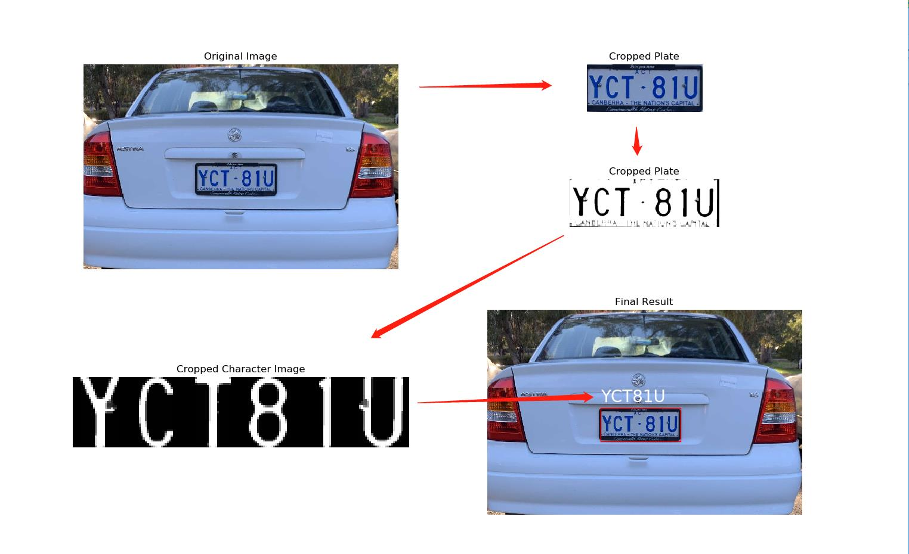

# Deep License Plate Recognition
License Plate Recognition (LPR) system is widely used in our daily life. Re-searchers have developed several methods to implement LPR system by us-ing morphology method, machine learning, or neural network. Our group project aims to implement LPR system. Our approach combines morphology method in plate detection and character segmentation, and neural network in character recognition. 

### Dependencies
Python 3.6  
Pytorch 1.1  
OpenCV >= 4.0  
Numpy  
Matplotlib  

#### install dependencies
1.pip

    pip install -r requirements.txt

2.conda 

    conda install --yes --file requirements.txt

### Document Structure
- images
    - characters
    - cropped
    - output
    - raw
    - test
- model
- car_plate_location.py
- char_segmentation.py
- extract_dataset.py
- main.py
- models.py
- test.py
- train.py

### How to test
run the command  

    python main.py

### How to train
run the command

    python character_classification.py

### Contributors
Haotian Shi, Wenrui Li, Yu Yang, Yang Zheng, Xiaodi Zhang  
{u6158063, u6361099, u6412985, u6287751, u6368740}@anu.edu.au

For more details, see the documentation [Deep License Plate Recognition](Deep License Plate Recognition.pdf).
